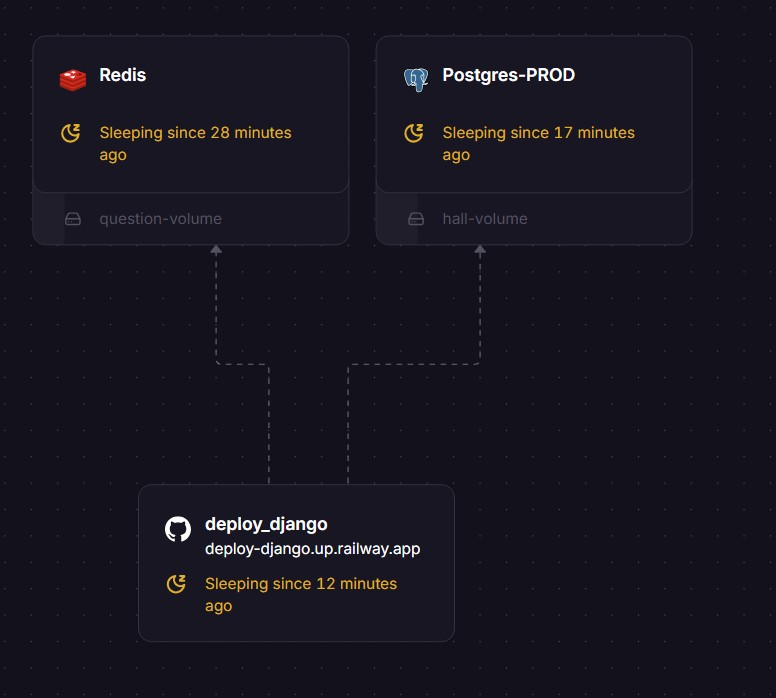

# Deploy Django Project

A sample Django project configured for easy deployment, demonstrating common practices for web application development and deployment using Docker and Railway.

## Screenshot



*Architecture*

## Technology Stack

*   **Backend:** Python 3.x, Django 5.2rc1
*   **Database:** PostgreSQL (configured via `dj-database-url`)
*   **Caching:** Redis (via `django-redis`)
*   **WSGI Server:** Waitress
*   **Static Files:** Whitenoise (with Brotli compression)
*   **Configuration:** `python-decouple` (for environment variables from `.env` file)
*   **Deployment:** Docker, Railway (`railway.json`)

## Features

*   Standard Django project structure.
*   Core application (`home`) handling basic views/URLs.
*   `commando` application containing custom Django management commands (e.g., `auto_admin.py`).
*   Static file serving configured with Whitenoise.
*   Database configuration using environment variables.
*   Ready for deployment with Docker and Railway.

## Local Setup

1.  **Clone the repository:**
    ```bash
    git clone <your-repository-url>
    cd deploy_django
    ```

2.  **Create and activate a virtual environment:**
    ```bash
    # On Windows
    python -m venv venv
    .\venv\Scripts\activate

    # On macOS/Linux
    python3 -m venv venv
    source venv/bin/activate
    ```

3.  **Install dependencies:**
    ```bash
    pip install -r requirements.txt
    ```

4.  **Set up environment variables:**
    *   Create a `.env` file in the root directory (where `manage.py` is located, i.e., `src/.env`).
    *   Add necessary environment variables based on `src/home/settings.py`. Minimally, you'll likely need:
        ```dotenv
        SECRET_KEY='your-secret-key'
        DEBUG=True
        DATABASE_URL='sqlite:///db.sqlite3' # Or your PostgreSQL URL
        # Add other variables like REDIS_URL if needed
        ```
    *   *Note:* For production, `DEBUG` should be `False` and you should use a strong `SECRET_KEY`.

5.  **Apply database migrations:**
    ```bash
    cd src
    python manage.py migrate
    ```

6.  **Run the development server:**
    ```bash
    python manage.py runserver
    ```
    The application should be available at `http://127.0.0.1:8000/`.

## Deployment

This project is configured for deployment using:

*   **Docker:** A `Dockerfile` is provided to build a container image. The `boot/docker-run.sh` script likely handles application startup within the container (e.g., running migrations and starting the WSGI server).
*   **Railway:** A `railway.json` file defines the build and deployment settings for the Railway platform.

Refer to the specific documentation for Docker and Railway for deployment steps.

## Project Structure

```
.
├── .gitignore
├── Dockerfile             # Docker configuration
├── railway.json           # Railway deployment configuration
├── requirements.txt       # Python dependencies
├── screenshot.jpg         # Project screenshot
├── boot/
│   └── docker-run.sh      # Script for running the app in Docker
└── src/                   # Main Django project source code
    ├── manage.py          # Django management script
    ├── commando/          # Custom Django app with management commands
    │   ├── management/
    │   │   └── commands/
    │   │       └── auto_admin.py # Example custom command
    │   └── ...
    ├── home/              # Core Django project configuration and app
    │   ├── settings.py    # Project settings
    │   ├── urls.py        # Root URL configuration
    │   ├── wsgi.py        # WSGI entry point
    │   └── ...
    ├── static_root/       # Collected static files (for production)
    ├── templates/         # Project-level templates
    └── ...                # Other apps, static files, etc.
